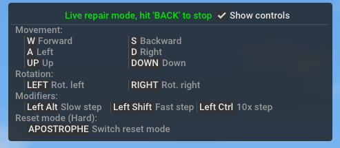

Hidden Features
============

## Hidden features

### Live repair 

Holding backspace for one second activates "live repair" mode, this enables the ability to move the vehicle during a reset:

Use `WASD` keys to move and arrow keys for height and rotation. Hold `CTRL` or `SHIFT` to increase movement speed and `ALT` to decrease speed.

Pressing the `APOSTROPHE` key toggles 'soft reset' mode. This allows for moving a vehicle without performing an actual reset, including any attached trailers or loads.

### Cruise control 

While driving any land vehicle, pressing the space bar toggles cruise control on/off. 
When activated, it automatically locks the current speed and RPM. Use `CTRL+SPACE` to readjust to the current vehicle speed/RPM and `CTRL+R` /`CTRL+F` to increase or decrease the target speed respectively.

Currently the game does not show any notifications indicating cruise control is active.

### Attaching hooks by mouse click 

It is possible to attach hook nodes (e.g. trailer hitches) by left clicking the two nodes:
 
<video controls>
<source src="../../images/trailer_attach_mouseclick.mp4" type="video/mp4">
</video>

Left click the connected nodes to disconnect. May require a few clicks to work as nodes don't always align with the visual model.

### Disable camera restrictions 

By default the orbit camera doesn't allow for clipping through vehicles and terrains. These restrictions can be toggled with `RIGHT SHIFT+SPACE`. Useful on vehicles where the camera is positioned far away or if you need to look at a vehicle's underside.

### Change vehicle camera origin

Most vehicle cameras rotate around a specific node. This can be changed by middle clicking any part of a vehicle. Middle clicking anywhere outside the vehicle will reset the camera. 

Try not to click on a wheel, as doing so will bug out the camera (and possibly cause motion sickness). 

### Free camera roll

There are two ways to roll the free/fixed camera (`CTRL+C`/`ALT+C`) for screenshots:

#### Interior method 